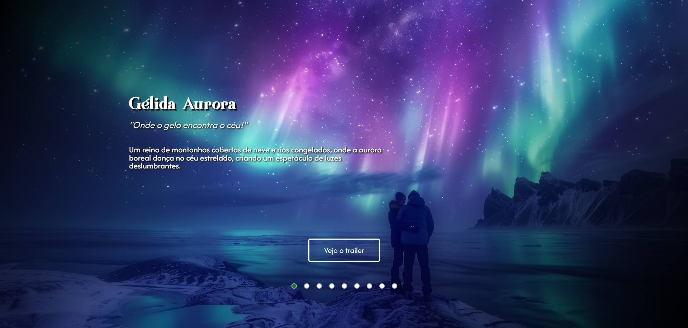
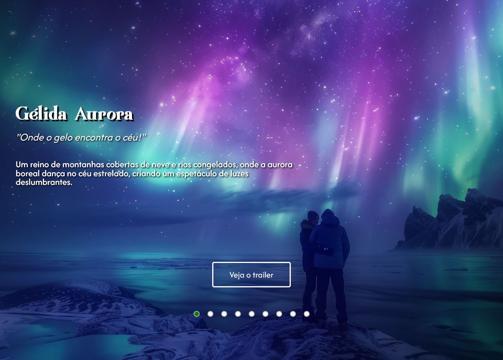
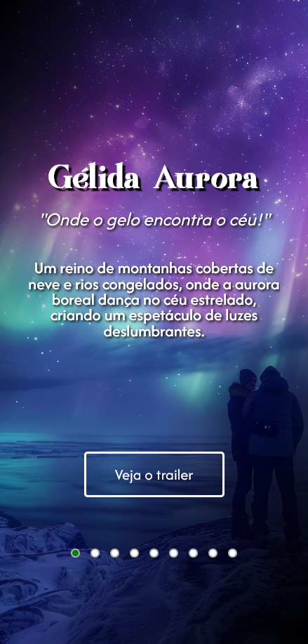

# Site – Empresa de Viagens Fictícia – Horizontis Surrealis

Continuando a prática de HTML e CSS puro, acabei a primeira etapa de um site de uma empresa fictícia de viagens surrealistas. Estou me acostumando a procurar manter o design fluído em todas as janelas, antes batia muito a cabeça nisso, agora tenho conseguido fazer pensar nas soluções mais facilmente, porém de longe o mais difícil foi raciocinar em como estruturar a mudança de imagens e de informações que será visível quando concluir o JavaScript desse projeto. De resto, serviu para reforçar os conceitos já aprendido, que já consigo relembrar com certa facilidade. Que venha o próximo!

## Visão geral

### ⚔️ O desafio

- Construir um site para uma empresa fictícia de viagens com fundo e descrições de destinos surrealistas.

### 🖼️ Aparência

  
  

### 🖇️ Links

- Acesso ao site: [https://trincode.github.io/site-horizontis-surrealis/](https://trincode.github.io/site-horizontis-surrealis/)
- Repositório github: [https://github.com/trincode/site-horizontis-surrealis](https://github.com/trincode/site-horizontis-surrealis)

## Meu processo

### Tecnologias

- HTML
- CSS

### Desafios e Conceitos aplicados

- Responsive Design
- CSS Flexbox
- Criação de estrutura para transição de imagens

### O que aprendi

- Para aplicar a imagem ao fundo sem distorções ao alterar o tamanho da janela do usuário usei a seguinte estrutura html:

```html
    <div class="rotacao-de-foto">
        
    </div>
```
Já no css a estilização pode ser dividida em duas partes, uma estilização da div (pai) que contém a imagem, e outra na própria imagem. 
Na div (pai):

```css
.rotacao-de-foto {
    position: fixed;
    top: 0;
    left: 0;
    z-index: -1;
}
```

E na própria imagem:

```css
.rotacao-de-foto .foto {
    height: 100vh;
    width: 100vw;
    object-fit: cover;
    display: none;
}
```

- E para aplicar uma imagem sobreposta a essa própria imagem usando a subclasse ::after para criar um sombreado entre as informações e acima da imagem para melhorar a legibilidade das letras:

```css
main::after {
    content: url('');
    min-height: 100vh;
    width: 100vw;
    position: fixed;
    top: 0;
    left: 0;
    background: linear-gradient(304deg, rgba(0,0,0,1) 0%, rgba(250,250,250,0) 40%, rgba(255,255,255,0) 50%, rgba(250,250,250,0) 60%, rgba(0,0,0,1) 100%);
    z-index: -1;  
}
```

- Para criar uma animação para a imagem aparecer gradualmente, são dois passos, primeiro criar o nome da animação e a animação com a opacidade:

```css
@keyframes fadeInImagem {
    0% {
        opacity: 0.85;
    }
    100% {
        opacity: 1.0;
    }
}
```

E depois, aplicar a propriedade da animação no seletor da imagem que deseja aplicar o efeito:

```css
    animation: fadeInImagem 0.7s;
```

- Também acabei relembrando que para aplicar no projeto uma fonte a qual só se tem seu arquivo é preciso usar o @font-face, como fiz em:
- 
```css
@font-face {
    font-family: "Rudisfave demo";
    src: url(../fontes/Rudisfave\ demo.ttf);
    src: url(../fontes/Rudisfave\ demo.otf);
}
```

### Desenvolvimento contínuo

É necessário tornar possível a transição dos destinos de viagens através dos botões abaixo.

### Recursos úteis

Sem recursos úteis inéditos a citar.

## Autor

- LinkedIn - [Clayton Trindade](https://www.linkedin.com/in/clayton-trindade-93b925329/)

- Instagram - [@trincode - Clayton Trindade](https://www.instagram.com/trincode/)

## Agradecimentos

Meus agradecimentos aos [@roberto-hofstetter](https://github.com/roberto-hofstetter) e [@cadudias](https://github.com/cadudias), criadores do DevQuest, curso no qual aprendi a maioria dos conhecimentos utilizados aqui nesse projeto!

